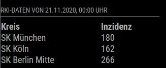

# MMM-RKI-Covid19
A [MagicMirror²](https://magicmirro.builders) module for RKI-Covid19 Data



## Dependencies
This module depends on the following API:<br>
https://npgeo-corona-npgeo-de.hub.arcgis.com/datasets/917fc37a709542548cc3be077a786c17_0 <br>
The API can be used without any registration

## Installation

Go to your MAcigMirror's module folder:
cd ~/MagicMirror/modules

Clone this repository:
````
git clone https://github.com/fhinder/MMM-RKI-Covid19.git
````
Add the module to the modules list in  your config file:

````javascript
{
	module: "MMM-RKI-Covid19"
	position: "top_right"
	config:{
		reloadInterval: 60*60*1000,
		tableClass: "small",
		counties: [		
			'SK Köln',
			'SK Berlin Mitte',
			'SK München' 
		]
	}
},
````
## Configuration

|option         | description|
|---------------|------------|
|reloadInterval | Reload Interval in ms <br> <b>Possible values</b>: <code>number</code> <br> <b>Default value</b>: 3600000 |
|tableClass	| Table configuration <br> <b>Default value</b>: "small" |
|counties	| Array of counties to be displayed. List of counties can be found in the API manual (check dependencies). <br> <b>Possible values</b>: <code>array of string</code> <br> <b>Default value</b>: ['SK Köln', 'SK Berlin Mitte', 'SK München'] |


## Development Status
The module is in WIP, but the basic functionality is available.
